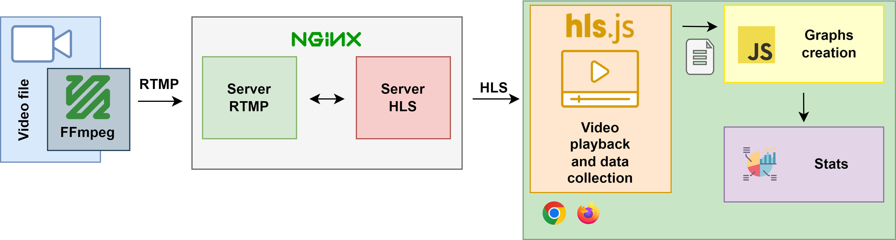

# Architecture

Tools to evaluate the QUIC transport protocol as the basis for the newly implemented HTTP/3 in the context of video streaming.



Script developed using [hls.js](https://github.com/video-dev/hls.js) framework with the aim of receiving and playing back the video while collecting specific playback metrics. Additionally, a tool is created to analyze and generate graphs based on the acquired data.

# Run
*This guide was made for Debian Linux.*

## Prerequisites

1. Install nginx-quic with RTMP module (Guide [here](docs/nginx.md)).
2. Create SSL certificates needed (Guide [here](docs/ssl.md)).
3. Install ffmpeg.
4. Add *video.dev* to *hosts* file.


## How to inicialize 


1. Clone this repository.

2. Inicialize nginx with propper configuration mencion in prerequisites.
   ```console
   $ sudo nginx -g 'daemon off;'
   ```

3. Start ffmpeg.
   ```console
   $ ffmpeg -stream_loop -1 -re -i <path-to-video> -vcodec libx264 -vprofile baseline -g 30 -acodec aac -strict -2 -f flv rtmp://localhost/show/stream
   ```
   
4. Open main.html (src/main.html) with prefered browser (using the proper configuration metion [here](docs/h3browsers.md)).
   
   - *Example for Google Chrome in HTTP/3 mode.*
      ```console
      $ google-chrome --enable-quic --origin-to-force-quic-on=video.dev:443 main.html
      ```

5. Select the protocol used, the duration of the capture and click the button.
   

6. After doing the captures the files generated can be open and analised with graphs.html (src/graphs.html).
   

## Copyright
Attribution-NonCommercial-ShareAlike 4.0 International
